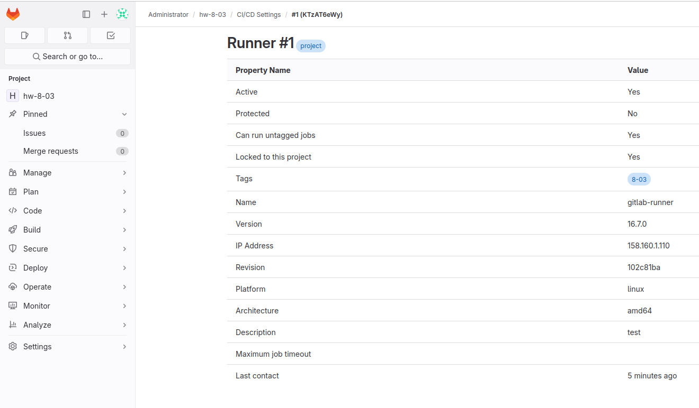
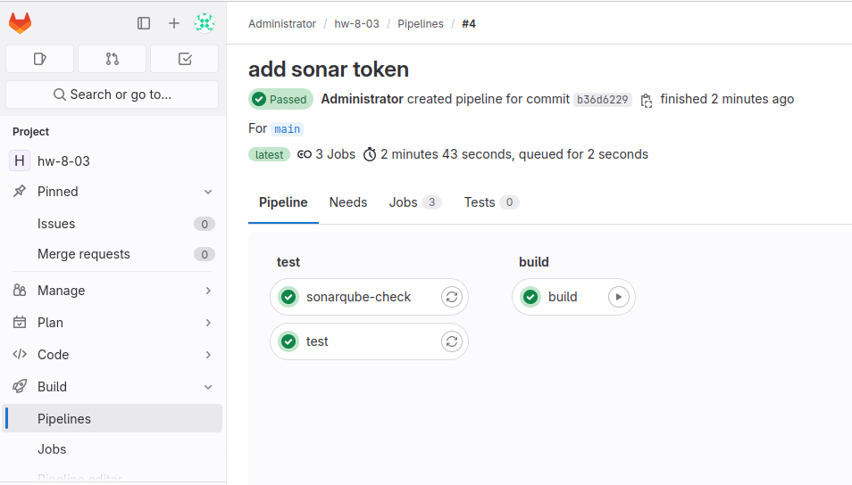
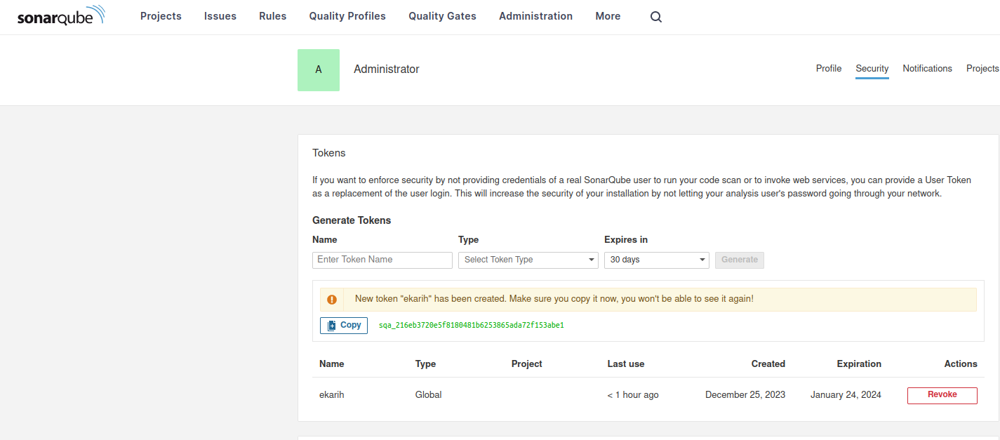

# Домашнее задание "Что такое DevOps. CI/CD" - Карих Елена
  Netology

## Задание 1

1. Разверните GitLab локально, используя Vagrantfile и инструкцию, описанные в этом репозитории.
2. Создайте новый проект и пустой репозиторий в нём.
3. Зарегистрируйте gitlab-runner для этого проекта и запустите его в режиме Docker. Раннер можно регистрировать и запускать на той же виртуальной машине, на которой запущен GitLab.

В качестве ответа в репозиторий шаблона с решением добавьте скриншоты с настройками раннера в проекте.

## Решение 1

Запустила runner:


## Задание 2

1. Запушьте репозиторий на GitLab, изменив origin. Это изучалось на занятии по Git.
2. Создайте .gitlab-ci.yml, описав в нём все необходимые, на ваш взгляд, этапы.

В качестве ответа в шаблон с решением добавьте:
* файл gitlab-ci.yml для своего проекта или вставьте код в соответствующее поле в шаблоне;
* скриншоты с успешно собранными сборками.

## Решение 2

Файл .gitlab-ci.yml:
```
stages:
  - test
  - build

test:
  stage: test
  image: golang:1.16
  script:
   - go test .

sonarqube-check:
 stage: test
 image:
  name: sonarsource/sonar-scanner-cli
  entrypoint: [""]
 variables:
 script:
  - sonar-scanner -Dsonar.projectKey=hw-8-03 -Dsonar.sources=. -Dsonar.host.url=http://158.160.1.110:9000 -Dsonar.login=sqa_216eb3720e5f8180481b6253865ada72f153abe1

build:
  stage: build
  image: docker:latest
  only:
    - master
  script:
   - docker build .

build:
  stage: build
  image: docker:latest
  when: manual
  except:
    - master
  script:
   - docker build .
```
Результат pipeline:


Создала token для sonar:

